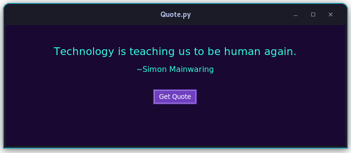

# quote.py
 Quote Generator

## Installation of the Quote.py Project

This project provides a Python application that displays random technology-related quotes in a Graphical User Interface (GUI) using the Tkinter library. To get started using this project, follow the installation steps below.

### Prerequisites

Before installing the project, make sure you have Python 3.x installed on your system. You can download Python from [python.org](https://www.python.org/downloads/).

### Installation Steps

**You can download for windows without python!**

1. Clone the GitHub repository to your local machine using the following command:

   ```bash
   git clone https://github.com/milosnowcat/quote.py.git
   ```

   Replace `yourusername` with your GitHub username or use the correct repository URL.

2. Navigate to the project directory:

   ```bash
   cd quote.py
   ```

3. Install the project dependencies using pip:

   ```bash
   pip install -r requirements.txt
   ```

4. Run the Quote.py application:

   ```bash
   python quote.py
   ```

   This will open the user interface of the application where you can get random technology-related quotes by clicking the "Get Quote" button.

That's it! You have successfully installed and run the Quote.py project on your system.

## Using the Quote.py Project

Quote.py is a Python application that allows you to obtain random technology-related quotes in a Graphical User Interface (GUI). Below are the steps for using the application.

### User Interface

The user interface consists of a window displaying a quote and its author, along with a button to fetch a new quote.



### Getting a Quote

1. Open the Quote.py application following the installation steps.

2. In the application window, you will see an empty quote and a "Get Quote" button.

3. Click the "Get Quote" button.

4. The application will send a request to an API to fetch a random technology-related quote.

5. Once the quote is obtained, it will appear in the application window along with the author's name.

6. You can fetch additional quotes by clicking the "Get Quote" button again.

### Customizing Appearance

The application uses the "Poppins" font for displaying quotes and authors. You can customize the appearance by changing the font type in the source code by modifying the `select_font` function.

```python
# Change the font type by passing "Medium" or "Regular" as an argument
quote_label = ttk.Label(frm, text="", font=(select_font("Medium"), 16), wraplength=650)
author_label = ttk.Label(frm, text="", font=(select_font("Regular"), 12))
```

### Closing the Application

To close the application, simply close the Quote.py application window.

Enjoy exploring inspiring technology-related quotes!
